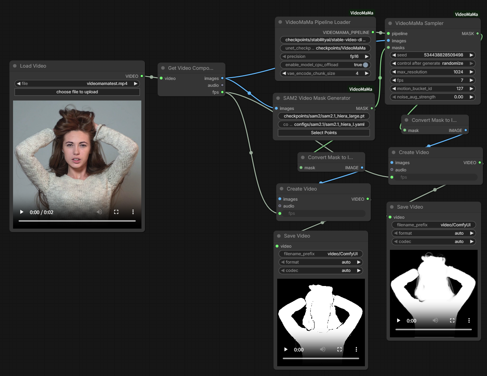
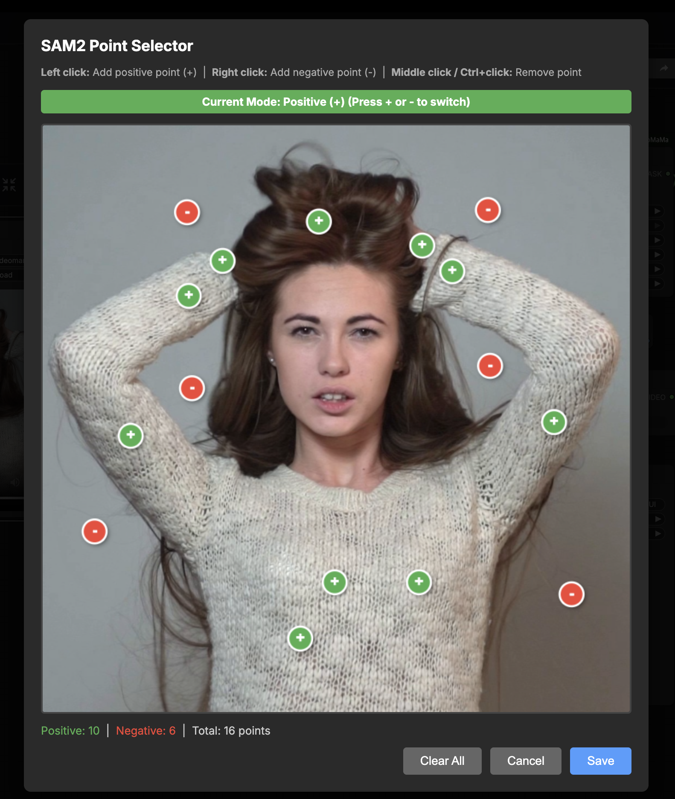

# VideoMaMa - ComfyUI Custom Nodes

ComfyUI custom node implementation of VideoMaMa for video matting with mask conditioning.



> **Original Research:** [VideoMaMa: Mask-Guided Video Matting via Generative Prior](https://arxiv.org/abs/2601.14255)
> **Original Repository:** [cvlab-kaist/VideoMaMa](https://github.com/cvlab-kaist/VideoMaMa)
>
> This is a ComfyUI custom node implementation. All credit goes to the original authors for their excellent research and open-source contribution.

## Installation

### 1. Clone Repository

```bash
cd /path/to/ComfyUI/custom_nodes/
git clone https://github.com/okdalto/ComfyUI-VideoMaMa
cd ComfyUI-VideoMaMa
pip install -r requirements.txt
```

### 2. Download Models

#### Base Model (Auto-download)
The Stable Video Diffusion base model will be **automatically downloaded** on first use if not present.

To download manually:
```bash
huggingface-cli download stabilityai/stable-video-diffusion-img2vid-xt \
    --local-dir checkpoints/stabilityai/stable-video-diffusion-img2vid-xt
```

#### VideoMaMa Checkpoint (Auto-download)
The VideoMaMa UNet checkpoint will be **automatically downloaded** on first use if not present.

To download manually:
```bash
huggingface-cli download SammyLim/VideoMaMa \
    --local-dir checkpoints/VideoMaMa
```

#### SAM2 (Optional - for mask generation)
```bash
# Install SAM2
git clone https://github.com/facebookresearch/sam2
cd sam2 && pip install -e .

# Download checkpoint
mkdir -p ../checkpoints/sam2
cd ../checkpoints/sam2
wget https://dl.fbaipublicfiles.com/segment_anything_2/092824/sam2.1_hiera_large.pt

# Download config
mkdir -p ../../configs/sam2.1
cd ../../configs/sam2.1
wget https://raw.githubusercontent.com/facebookresearch/sam2/main/sam2/configs/sam2.1/sam2.1_hiera_l.yaml
```

### 3. Restart ComfyUI

The nodes will appear under the **VideoMaMa** category.

## Available Nodes

### 1. VideoMaMa Pipeline Loader
Loads the inference pipeline with base SVD model and fine-tuned UNet.

**Inputs:**
- `base_model_path`: Path to base SVD model (default: `checkpoints/stabilityai/stable-video-diffusion-img2vid-xt`)
- `unet_checkpoint_path`: Path to fine-tuned UNet (default: `checkpoints/VideoMaMa`)
- `precision`: `fp16` or `bf16` (default: `fp16`)

**Outputs:**
- `VIDEOMAMA_PIPELINE`: Pipeline object

### 2. VideoMaMa Run
Runs video matting inference with mask conditioning.

**Inputs:**
- `pipeline`: Pipeline from loader
- `images`: Input video frames [N, H, W, C]
- `masks`: Mask frames [N, H, W, C]
- `seed`: Random seed (default: 42)
- `max_resolution`: Longest axis resolution for processing (default: 1024, range: 256-2048). Aspect ratio is preserved and dimensions are aligned to multiples of 8.
- `fps`: Frames per second (default: 7)
- `motion_bucket_id`: Motion intensity (default: 127)
- `noise_aug_strength`: Noise augmentation (default: 0.0)

**Outputs:**
- `MASK`: Generated mask frames [N, H, W] (at original input resolution)

### 3. SAM2 Video Mask Generator
Generates masks using SAM2 video tracking (requires SAM2 installation).

**Inputs:**
- `images`: Input video frames
- `checkpoint_path`: SAM2 checkpoint path
- `config_file`: SAM2 config path
- `user_input`: Point coordinates from SAM2 Point Selector UI

**Outputs:**
- `IMAGE`: Generated mask frames

#### SAM2 Point Selector UI

Click the `user_input` field to open the interactive point selector:



**Controls:**
- **Left click**: Add positive point (+) - marks foreground/object to segment
- **Right click**: Add negative point (-) - marks background to exclude
- **Middle click / Ctrl+click**: Remove existing point
- **+ / - keys**: Switch between positive and negative mode

**Usage Tips:**
- Place positive points (green) on the object you want to extract
- Place negative points (red) on background areas to exclude
- More points = more accurate segmentation
- Click **Save** to confirm, **Cancel** to discard, **Clear All** to reset

## Example Workflow

Example workflow files are available in the [`examples/`](examples/) folder. Import these directly into ComfyUI to get started quickly.

**Basic Steps:**
1. **Load video** → Use VHS Video Loader or similar
2. **Generate masks** → Use SAM2 node or load existing masks
3. **Load pipeline** → VideoMaMa Pipeline Loader
4. **Run inference** → VideoMaMa Run (connect pipeline, images, masks)
5. **Save output** → VHS Video Combine or Preview Image

## Tips

- **Resolution**: `max_resolution` controls the longest axis. Aspect ratio is preserved and output is resized back to the original input resolution. For example, a 1920x1080 input with `max_resolution=1024` is processed at 1024x576.
- **Motion Bucket**: Lower (50-100) = subtle, Higher (150-200) = dynamic
- **VRAM**: Higher `max_resolution` requires more VRAM

## Troubleshooting

**"SAM2 is not available"**
```bash
git clone https://github.com/facebookresearch/sam2
cd sam2 && pip install -e .
```

**"Failed to load pipeline"**
- Check model paths are correct
- Ensure all model files downloaded
- Check VRAM availability

**"Frame count mismatch"**
- Ensure image and mask sequences have same number of frames

## Requirements

- Python 3.10+
- PyTorch 2.0+ with CUDA
- GPU with sufficient VRAM
- ComfyUI

See `requirements.txt` for full dependencies.

## Directory Structure

```
VideoMaMa/
├── __init__.py
├── nodes.py
├── pipeline_svd_mask.py
├── requirements.txt
├── checkpoints/
│   ├── stabilityai/stable-video-diffusion-img2vid-xt/
│   ├── VideoMaMa/unet/
│   └── sam2/ (optional)
└── configs/sam2.1/ (optional)
```

## Acknowledgments

This ComfyUI implementation is based on the excellent work by the KAIST CVLab team:

**VideoMaMa: Mask-Guided Video Matting via Generative Prior**
- Paper: https://arxiv.org/abs/2601.14255
- Original Repository: https://github.com/cvlab-kaist/VideoMaMa
- Authors: KAIST Computer Vision Lab

We are grateful to the authors for:
- Their groundbreaking research in video matting
- Making their code and models publicly available
- Advancing the field of generative video processing

This custom node is simply a wrapper to make VideoMaMa accessible in ComfyUI. All model weights, training methods, and core algorithms are from the original research.

## Citation

If you use VideoMaMa in your work, please cite the original paper:

```bibtex
@article{videomama2025,
  title={VideoMaMa: Mask-Guided Video Matting via Generative Prior},
  author={[Authors from KAIST CVLab]},
  journal={arXiv preprint arXiv:2601.14255},
  year={2025}
}
```

## License

This project follows the original VideoMaMa license terms. Please refer to the [original repository](https://github.com/cvlab-kaist/VideoMaMa) for licensing details.
